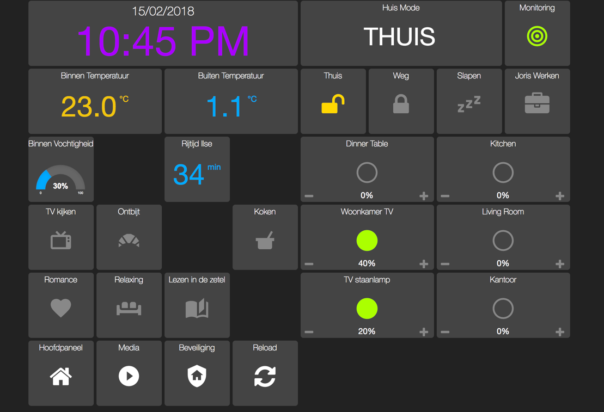

# casa
Set of ansible playbooks that I use to maintain my [homeassistant](home-assistant.io)-based home automation stack.



I maintain this purely for fun (often favoring speed and exploration over quality) and really only with my own use-cases
in mind, so use at your own risk! I don't expect the actual code to work for anyone but me, so please consider this as
more as a reference rather than a plug-and-play solution.

You might see a reference here and there to ```casa-data```: this is a private repo I maintain that contains the actual
data relevant to my home (usernames, passwords, secrets, IP addresses, etc). The roles and playbooks in this repo all
use dummy defaults.

Also, since my family's mother tongue is Dutch, you'll see some Dutch language used here and there
(mostly in the user-facing parts).
# Setup
## Hardware
I run the whole automation stack on a 2011 Macbook Pro running Ubuntu 17.10.

Here's a list of home-automation gear I use that is integrated with casa:
- Sonos play 5, play 1, play base
- Philips Hue light bulbs
- Ikea Tradfri light bulbs (and movement sensors, remote controls)
- iPad mini control planels
- Chromecast
- Nest Cam
- Nest Thermostat
- Nest Protect smoke detectors
- TP link HS100 and HS110 Power Switches
- Samsung SmartTV UE48H6200AW
- A simple custom-build Arduino sensor for measure the current height of my standing desk

Other gear I have that is currently not (yet) integrated in the setup:
- AppleTV (there are some issues with pyatv turning on the TV randomly)
- Elgato Eve Window sensor
- Elgato Eve Power plug
- Amazon Echo dot

## Software Stack

The best way to get a quick overview of the software stack is to look at roles directory


| Software                                                                        | Description         |
| ------------------------------------------------------------------------------- | ------------------- |
| Ubuntu 17.10                                                                    | Operating Systems   |
| [Homeassistant](https://home-assistant.io/)                                     |                     |
| [HADashboard](http://appdaemon.readthedocs.io/en/stable/DASHBOARD_INSTALL.html) |                     |
| [node-sonos-http-api](https://github.com/jishi/node-sonos-http-api)             |                     |
| [Sensu](https://sensuapp.org/)                                                  | Monitoring solution |
| InfluxDB                                                                        |                     |
| Grafana                                                                         |                     |
| Logstash                                                                        |                     |
| slack                                                                           |                     |
| Docker                                                                          |                     |
| roofcam                                                                         |                     |
| ELK                                                                             |                     |

# Getting Started

I'm currently using Ansible 2.4.2 and am using some Ansible 2.4 specific features in the playbooks, so that's the
version of ansible you'll need :)

### DEV
Development should be done locally in Vagrant.
```bash
vagrant up
ansible-playbook home.yml -i inventory/vagrant
# roofcam only
ansible-playbook home.yml -i inventory/vagrant --tags roofcam
# using production data
ansible-playbook home.yml -i  ~/repos/casa-data/inventory/vagrant
```