# casa
Set of [Ansible](https://www.ansible.com/) playbooks that I use to maintain my [homeassistant](home-assistant.io)-based home automation stack.
This repository also contains playbooks for a bunch of auxillary systems that are part of my setup such as [prometheus](https://prometheus.io/), [grafana](https://grafana.com/), [ELK](https://www.elastic.co/elk-stack), [InfluxDB](https://docs.influxdata.com/influxdb), [AppDaemon](https://appdaemon.readthedocs.io/en/latest/) and some others (see  below).

**I maintain this purely for fun (favoring speed and exploration over quality and documentation) and really only with my own use-cases
in mind, so use at your own risk! I don't expect the actual code to work for anyone but me, so please consider this as
more as a reference/demo rather than a plug-and-play solution.**

To get an idea of some of the automations I'm using, have a look at the [homeassistant](https://github.com/jorisroovers/casa/tree/master/roles/homeassistant/) directory.

*Screenshot of main dashboard running on wall-mounted iPads*
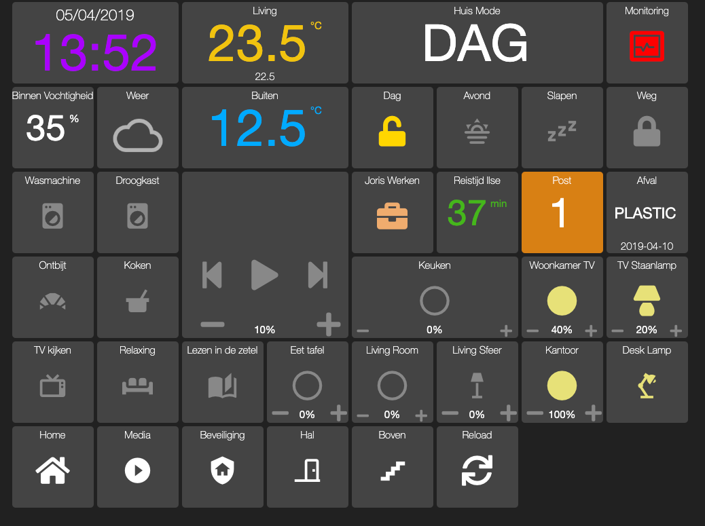

# Table of Contents
- [General Notes](#General-Notes)
- [Screenshots](#Screenshots)
- [Setup Details](#Setup-Details)
  - [Hardware](#Hardware)
  - [Software](#Software)
- [Getting Started](#Getting-Started)

# General Notes

- You might see some references to ```casa-data```: this is a private repo I maintain that contains the actual
data (encrypted) relevant to my home (usernames, passwords, secrets, IP addresses, etc). The roles and playbooks in this repo all
use dummy defaults.
- Since my family's mother tongue is Dutch, you'll see some Dutch language used here and there
(mostly in the user-facing parts).
- I try to keep my setup completely disconnected from the Internet for security and privacy reasons. There are some exceptions (like some Nest devices I use), but those connect outward to the internet themselves - it's not possible to directly connect to any device from the Internet as everything runs in a private network.
- I'm constantly thinking of new things I can improve my setup and have a long list of TODO items I keep outside of this repository (this makes it easier to jot them down while not in front of a computer). Some bigger things that are a bit tricky (or expensive) but that I want to eventually get to are: automated sliding curtains, automated window opening, automated doorlocks.
- I have no idea how much time I've spend getting to this point, but I'm fairly certain it's a couple of hundreds of hours at least. Spread over about 2 years.
- I've never done a calculation of how much the current setup has cost me, but I'd roughly guess it's in the 2000-3000 EUR range. Note that it also highly depends on how you calculate things. Do you account for a (smart) TV? What about smart audio speakers? An old laptop that you had still lying around that you use as a server? Light bulbs you needed to buy anyways but you bought smartbulbs instead? etc.
- If you're new to home-automation and want to do something similar to this, I recommend getting a [Raspberry Pi](https://www.raspberrypi.org/products/) (get the latest model with the most compute power) and installing [HomeAssistant](https://www.home-assistant.io/) on it. Then get yourself a set of [Philips Hue](https://www2.meethue.com/en-us) or [Ikea Tradfri](https://www.ikea.com/us/en/catalog/products/20411562/) smart light bulbs and start playing!

# Screenshots

## Main Control interface
This interface is build in [appdaemon](https://appdaemon.readthedocs.io/en/latest/DASHBOARD_CREATION.html) (with some customizations) and displayed on 3 wall-mounted iPad minis around the house. This is our primary way of interacting with the system. Under-the-hood this is just a webpage served from the main server and the iPads are just showing those as standalone webapps (=no browser chrome showing) with displays set to always-on. The first iPad I mounted has been continuously running for over 18 months without issues.

### Home


### Media
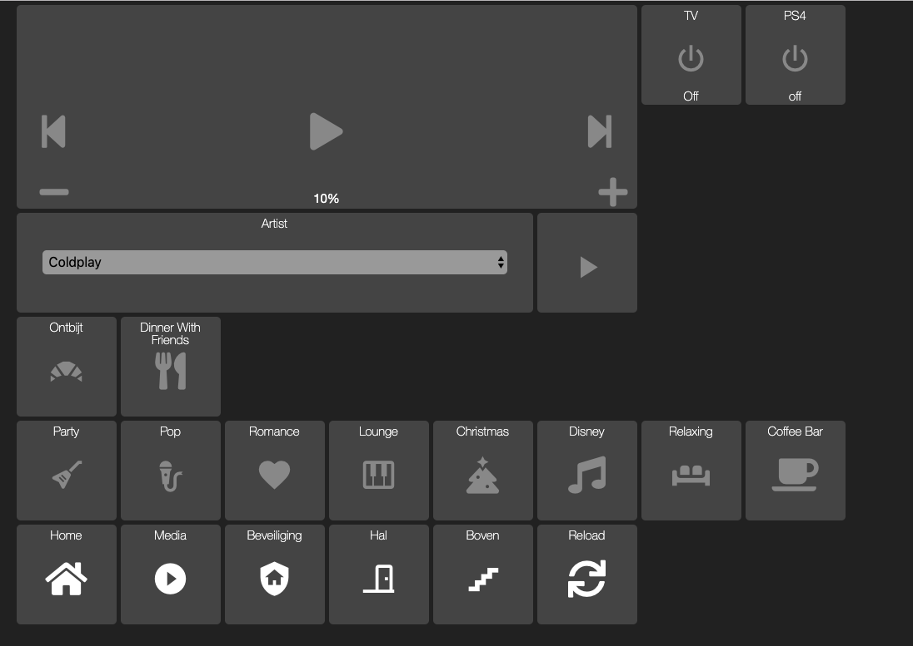

### Security
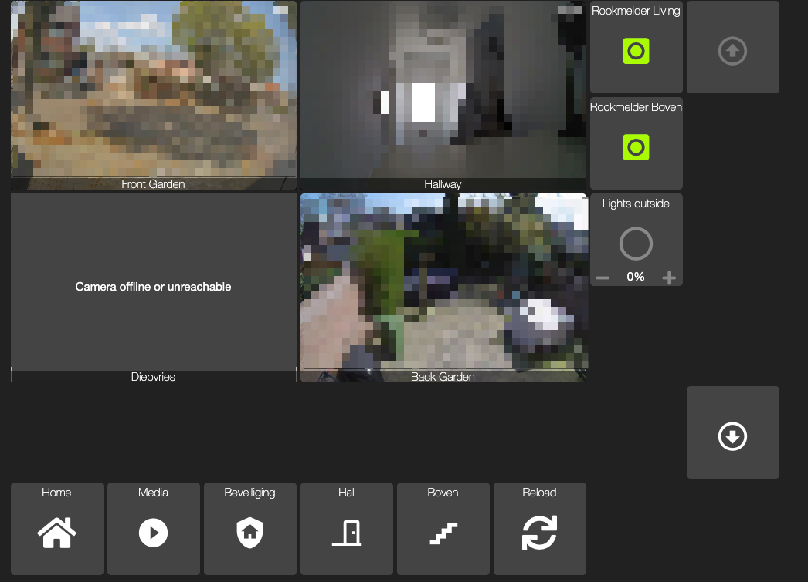

### Hallway
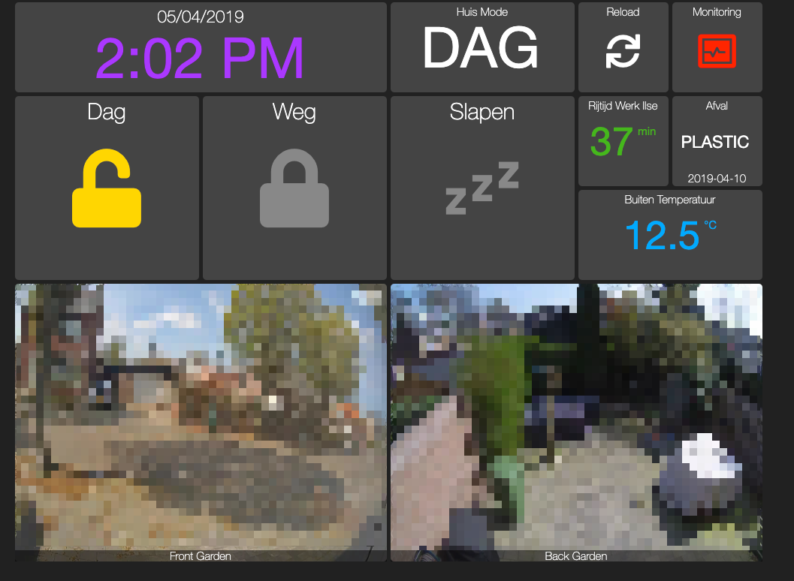

### Upstairs
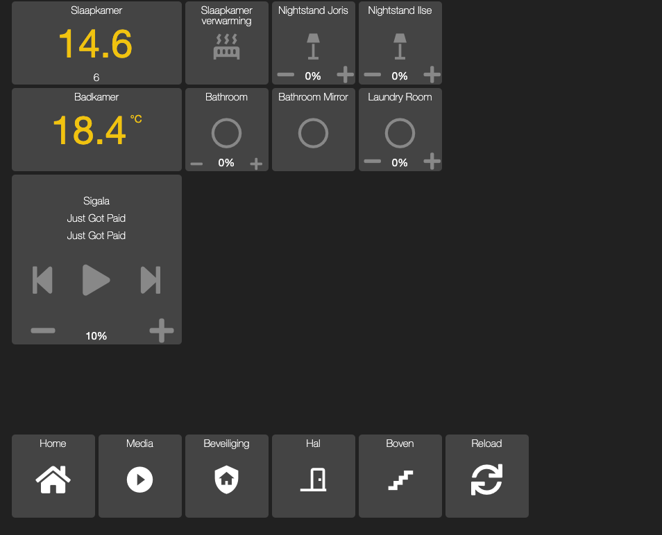

### Monitoring
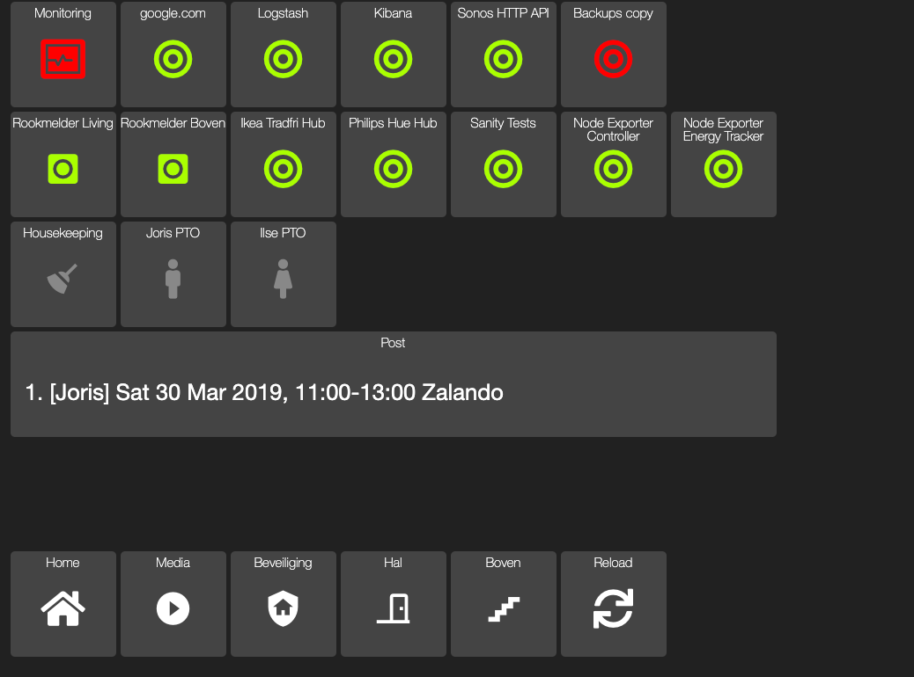

### Phone
This interface is more optimized for mobile (this one needs a few bugfixes).

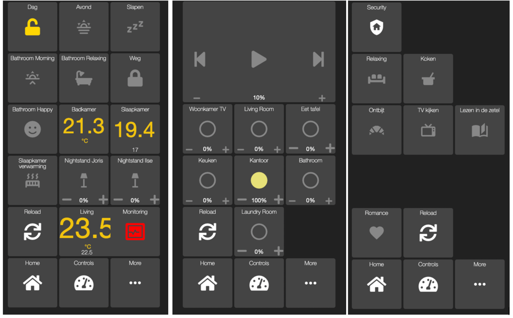

## Homeassistant

In the background, [homeassistant](https://www.home-assistant.io/) is actually doing all the heavy lifting. While Homeassistant comes with its own UI, I only use it during development or troubleshooting. The main reason is that the interface is just not as user-friendly as the appdaemon dashboards for permanently wall-mounted tablets (in which big buttons are the way to go).
 With the introduction of [lovelace](https://www.home-assistant.io/lovelace/) more recently, the flexibilty to define your own UI has vastly improved, but from what I've seen and read I still find my existing appdaemon dashboard more appealing. In addition, it would be a considerable amount of effort for me to port all my customizations over to lovelace. One day maybe?

### Homeassistant Default interface
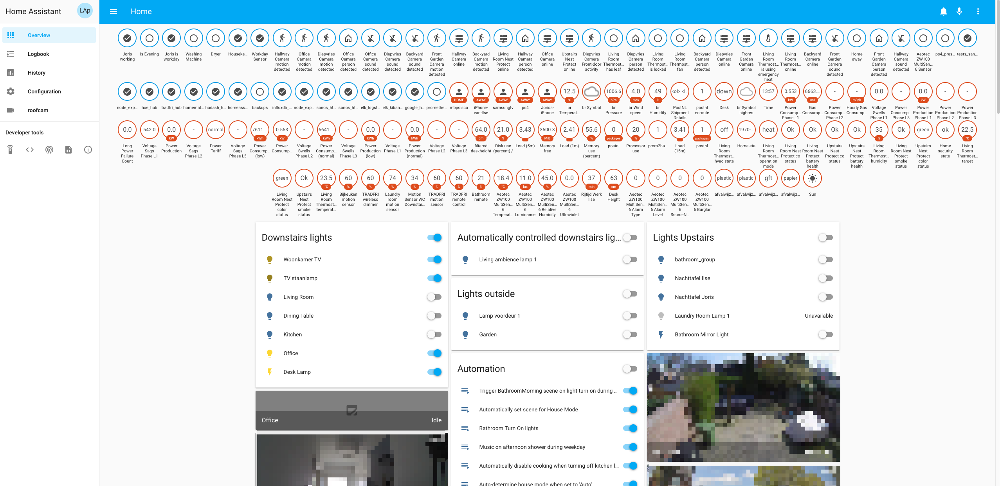

## Grafana
I use [Grafana](https://grafana.com/) to display metrics from Homeassistant, InfluxDB and Prometheus.

### Server health
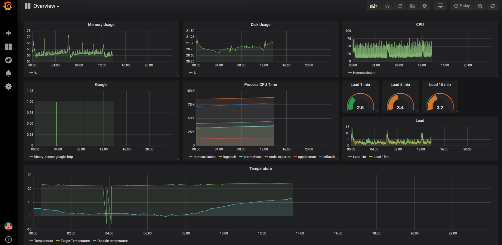

### House Statistics
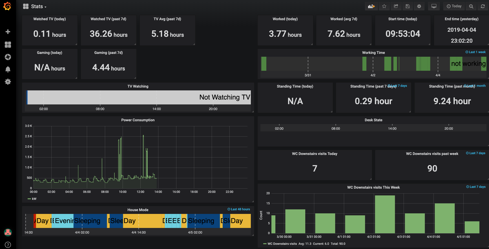

## Prometheus

I use [Prometheus](https://prometheus.io/) with [Node Exporter](https://github.com/prometheus/node_exporter), [Process Exporter](https://github.com/ncabatoff/process-exporter), [Blackbox exporter](https://github.com/prometheus/blackbox_exporter) and [Alert Manager](https://prometheus.io/docs/alerting/alertmanager/) to do monitor and alerting of my whole setup.

### Prometheus Alerts
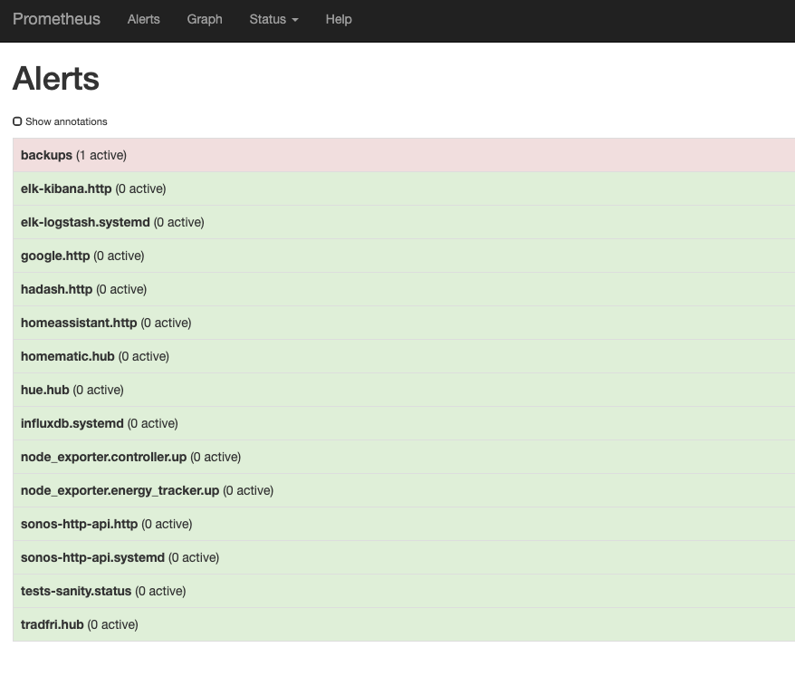

# Setup Details
## Hardware

I host the whole stack on a [2011 Macbook Pro](https://support.apple.com/kb/SP619?locale=en_US) with a 2.7GHz dual-core i7 and 8GB of memory running Ubuntu 17.10. While the machine can easily handle the load, I expect that at some point I'll replace it with something that is more suited for running 24x7 - I have some concerns about fire safety with the Macbook's built-in battery.

Here's a list of home-automation gear I currently have around my house:

| Hardware                                                                        | Notes                                   |
| ------------------------------------------------------------------------------- | ------------------- |
| [Sonos play 5, play 1, play base](https://www.sonos.com/en/shop/)               | Internet controllable quality speakers  |
| [Philips Hue](https://www2.meethue.com/en-us)                                   | Light bulbs, switches            |
| [Ikea Tradfri](https://www.ikea.com/us/en/catalog/products/20411562/)                                                                    | Light bulbs, switches, movement sensors |
| [Nest Cam](https://nest.com/cameras/)                                           | Security monitoring (also remotely). Own various models. |
| [Nest Thermostat](https://nest.com/thermostats/)                                | Climate control                         |
| [HomeMatic HmIP-CCU3](https://www.eq-3.com/products/homematic/control-units-and-gateways/-473.html) |  HomeMatic control unit  |
| [HomeMatic HM-CC-RT-DN](https://www.eq-3.com/products/homematic/heating-and-climate-control/homematic-wireless-radiator-thermostat.html#bestell_info)                         | Smart Radiator valves. Allows me to control temperature for radiators upstairs where I have no separate thermostat and heating circuit. |
| [Nest Protect smoke detectors](https://nest.com/smoke-co-alarm/overview/)      | Smart Smoke detectors  |
| [TP link HS100 and HS110 Power Switches](https://www.kasasmart.com/us/products/smart-plugs/kasa-smart-plug-energy-monitoring-hs110)                                          | Washing Machine and Dryer power monitoring (to detect whether they're running or not) |
| [Samsung SmartTV UE48H6200AW](https://www.samsung.com/nl/support/model/UE48H6200AWXXN/)                                                     | Our main TV - couple years old but has some basic smartTV features.  |
| [Wemos D1](https://wiki.wemos.cc/products:d1:d1)                                | A simple custom-build sensor using a cheap Arduino compatible board and an ultrasonic sensor to measure the current height of my standing desk. This allows me to track how much time I've been standing during the day. |
| [Aeotec Zwave Stick Gen5](https://aeotec.com/z-wave-usb-stick)                   | Simple [Z-wave](https://www.z-wave.com/) controller in USB-stick form factor |
| [Aeotec ZW100 MultiSensor](https://aeotec.com/z-wave-sensor)                     | Multi-sensor. Used to detect movement, temperature and humidity in bathroom |
| [iPad mini (Gen 2, Gen 4)](https://www.apple.com/lae/ipad-mini/)                                                        | Wall Mounted control panels             |
| [Raspberry Pi](https://www.raspberrypi.org/) + [DSMR](https://www.home-assistant.io/components/dsmr/)           | Raspberry Pi connected to smart energy meter for energy monitoring.  |


Other gear I have that is currently not (yet) integrated in the setup:

| Hardware                                                                        | Notes         |
| ------------------------------------------------------------------------------- | ------------------- |
| [AppleTV](https://www.apple.com/lae/tv/)                                        | There are some issues with [pyatv](https://github.com/postlund/pyatv) turning on the TV randomly that prevent me from properly integrating this |
| [Elgato Eve Window sensor](https://www.evehome.com/en/eve-door-window)          | HomeKit only. Not currently using. |
| [Elgato Eve Power plug](https://www.evehome.com/en/eve-energy)                  | Homekit only. Reset wifi every night at 4AM to deal with linksys router firmware issue. Blue-tooth based. Ability to power cycle network gear even when whole network is down. |
| [Amazon Echo dot](https://www.amazon.com/All-new-Echo-Dot-3rd-Gen/dp/B0792KTHKJ)              | Integration not possible without exposing homeasisstant to the internet. Still brainstorming on workarounds. |
| [Chromecast](https://store.google.com/product/chromecast)                       | We usually use our AppleTV(s) instead. |

## Software

| Software                                                                        | Description         |
| ------------------------------------------------------------------------------- | ------------------- |
| [Ubuntu 17.10](http://old-releases.ubuntu.com/releases/17.10/)  | Operating System. I need to upgrade to a later version since 17.10 is no longer officially supported.  |
| [Homeassistant](https://home-assistant.io/)       | Main home automation platform that integrates everything together.   |
| [HADashboard](http://appdaemon.readthedocs.io/en/stable/DASHBOARD_INSTALL.html) | Part of [appdaemon](https://appdaemon.readthedocs.io/en/latest/) that allows for easy creation of dashboards for Home Assistant that are intended to be wall mounted (optimized for distance viewing).|
| [Docker](https://www.docker.com/)      | A good amount of software components run in containers, I use plain docker to manage them. I've considered using something like docker swarm or kubernetes for management/orchestration, but given that I only run containers on a single machine for now, I don't believe the overhead is worth it.                    |
| [InfluxDB](https://docs.influxdata.com/influxdb)     | Time series database used to persistently store sensor and monitoring data.      | [Grafana](https://grafana.com/)                      |  Visualization dashboard to display metrics stored in homeassistant and influxDB.                  |
| [ELK](https://www.elastic.co/elk-stack) | Log Aggregation, Search Indexing, web dashboard. Don't use ELK very excessively as it uses too much memory and CPU for my liking. I'm considering switching to [fleuntd](https://www.fluentd.org/) for the log aggregation part - but the truth is that I get by with just some CLI commands for the majority of what I need. Having a log aggregation stack installed is mostly for exploration purposes.    |
| [Prometheus](https://prometheus.io/)   | Main monitoring platform that collects metrics on various components of my stack, and alerts when certain conditions are (not) met.   |
| [Alert Manager](https://prometheus.io/docs/alerting/alertmanager/) | Default alerting solution for prometheus. |
| [Node Exporter](https://github.com/prometheus/node_exporter) | Widely popular linux system data exporter for prometheus. |
| [Process Exporter](https://github.com/ncabatoff/process-exporter) | Prometheus exporter to collect metrics on specific linux processes |
| [Blackbox Exporter](https://github.com/prometheus/blackbox_exporter) | Prometheus exporter to collect metrics on external (blackbox) systems using network requests like ping, TCP connections, etc. |
| [node-sonos-http-api](https://github.com/jishi/node-sonos-http-api)             | HTTP API bridge for Sonos speakers. Fills some gaps in sonos features that HomeAssistant doesn't support.    |
| [Selenium](https://www.seleniumhq.org/)   | UI testing framework used as part of my sanity tests. Primarily used to periodically test that all dashboards are still loading correctly (if they're not, that's often an indicator of a bigger underlying issue). |
| [Slack](https://slack.com/)               | Used for sending notifications when certain events occur around the house.     |
| [SamTV](https://github.com/McKael/samtv) | Great little CLI tool I use to control my somewhat older Samsung SmartTV that isn't supported by homeassistant itself. |
| [Ser2net](http://ser2net.sourceforge.net/) | Simple way to expose a serial port to the network. I use this to expose a serial stream coming from a Raspberry PI connected to my smart electricity meter to homeassistant.   |
| [Monit](https://mmonit.com/monit/) | **No longer used**. When I started out, I used Monit for simple monitoring but I quickly required more elaborate monitoring capabilities. |
| [Sensu](https://sensu.io/) | **No longer used**. I migrated from Monit to Sensu for monitoring but over time that ended up consuming way too much CPU and memory which tended to slow my whole stack down. Currently on Prometheus. |

On many occasions there's been a need to write custom scripts to enhance functionality or integrate certain systems together. The table below shows a few that I think are worth calling out - you'll probably find more when browsing the source code of this repository.

| Software                                                                        | Description         |
| ------------------------------------------------------------------------------- | ------------------- |
| [Sanity tests](https://github.com/jorisroovers/casa/tree/master/tests) | Small set of python tests that run every 5 min against the setup that check for some common problems and misconfigurations. These have been great to catch issues when I've made changes to the setup. |
 [prom2hass](roles/homeassistant/templates/prom2hass.py)  | Custom python script that fetches certain prometheus metrics or alerts and pushes them to homeassistant as sensors. Runs every 20 seconds. Allows for automatation of parts of the house based on monitoring conditions from prometheus. While there exist upstream supported integrations between homeassistant and prometheus, from my initial assessment they didn't   seem to be a good fit. |
| [Seshat](https://github.com/jorisroovers/seshat) | Simple set of script(s) in typescript that aggregate some metrics from InfluxDB into more interesting statistics that I can display in grafana. These run every minute via a cronjob. |
| [roofcam](https://github.com/jorisroovers/roofcam)                 |  Simple custom python program to determine whether my flat roof has any water on it (which means the draining pipes are clogged up). Uses very simple image manipulations on screenshots to determine this. At some point I'd like to do something more advanced with ML, but the current script already is ~85% accurate on test data. Don't always have this program running.                    |
| [Afvalwijzer](roles/homeassistant-sensors/templates/afvalwijzer/afvalwijzer.py) | Simple script to determine when the next trash pick date is (exposed as sensors in homeassistant). Scrapes the Dutch [mijnafvalwijzer.nl](https://www.mijnafvalwijzer.nl/) once every 24 hours to determine this. |
| [Desk-height](https://github.com/jorisroovers/arduino-playground/blob/master/personal/deskheight/main/main.ino) | Simple Arduino-based sensor to determine the current height of my standing desk using an ultrasonic sensor mounted underneath it. This info is then send over to my home server which does some simple processing in logstash and home-assistant to determine whether the desk is up or down. This is then used to calculate and show standing time statistics in grafana. |
| [Backups](https://github.com/jorisroovers/casa/tree/master/roles/backups) | Set of scripts that do periodic backups of some personal data and copy the resulting tarballs over to a Samba/CIFS network share. Each backup script also has an accompanying monitoring script that periodically verifies whether the last backup was successful. |

# Getting Started

**Ok, the title of this section is a lie. Like I've mentioned at the start of this README, I don't really expect this playbook to work for anyone but me. But if you ARE me, here's how you actually run this against your target hosts :-).**

Note: I'm currently using Ansible 2.4.2 and am using some Ansible 2.4 specific features in the playbooks, so that's the version of Ansible you'll need.

## PROD

```bash
ansible-playbook -i ~/repos/casa-data/inventory/prod --tags node_exporter --limit controller home.yml

# Only run 'node_exporter' tag against target energy_tracker host
ansible-playbook -i ~/repos/casa-data/inventory/prod --tags node_exporter --limit energy* home.yml
```

## DEV
In the past I did development locally on a VM using Vagrant, but with the amount of sensors and containers involved, that no longer works well. For reference though:
```bash
vagrant up
ansible-playbook home.yml -i inventory/vagrant
# roofcam only
ansible-playbook home.yml -i inventory/vagrant --tags roofcam
# using production data
ansible-playbook home.yml -i  ~/repos/casa-data/inventory/vagrant
```