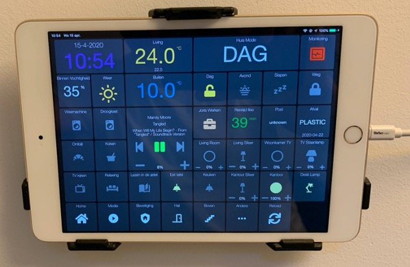
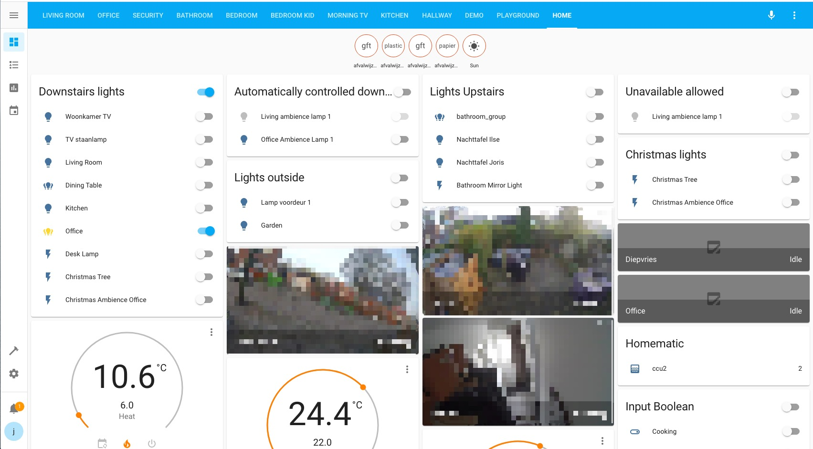
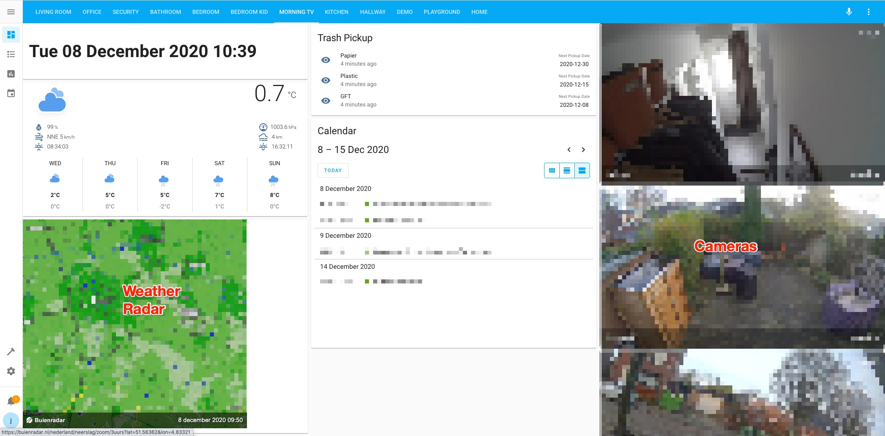

# casa

Home Automation stack based on [homeassistant](home-assistant.io).

In the past, I orchestrated everything through [Ansible](https://www.ansible.com/) including auxillary systems such as [Prometheus](https://prometheus.io/), [Grafana](https://grafana.com/), [AppDaemon](https://appdaemon.readthedocs.io/en/latest/) and more.

**2021-12-03: I've recently switched over to using the [Home Assistant Operating System](https://github.com/home-assistant/operating-system) running on [Home Assistant Blue](https://www.home-assistant.io/blue). I'm still in the process of updating this repo to reflect those changes.**

**I maintain this purely for fun (favoring speed and exploration over quality and documentation). Consider this a reference/demo rather than a re-usable solution**

Blogposts and write-ups:

- [Details of my conference talk *Creating the Ultimate Morning Routine* at the 2020 Home Assistant Conference](docs/Ultimate-Morning-Routine.md)
- Blogpost: [My Favorite Home Automations](https://jorisroovers.com/posts/my-favorite-home-automations)
- Blogpost: [Window Opener project](https://jorisroovers.com/posts/window-opener)
- Blogpost: [My Smart Sauna](https://jorisroovers.com/posts/my-smart-sauna)
- Details: [Curtain Opener project](projects/curtain-opener/README.md)

*Main dashboard running on wall-mounted iPad (using [AppDaemon HADashboard](https://appdaemon.readthedocs.io/en/latest/DASHBOARD_CREATION.html))*


# Menu

[Screenshots](#screenshots) |
[Hubs](#hubs) |
[Climate](#climate) |
[Windows/Curtains](#windowscurtains) |
[Lights](#lights) |
[Switches](#switches) |
[Voice Control](#voice-control) |
[Security](#security) |
[Sensors](#sensors) |
[Media](#media) |
[Other Hardware](#other-hardware) |
[Software Integrations](#software-integrations) |
[Supporting Software](#supporting-software) |
[Retired](#retired)
[General Notes](#general-notes)
[Future Notes](#future-work)

# Screenshots

The main interface is build in [appdaemon](https://appdaemon.readthedocs.io/en/latest/DASHBOARD_CREATION.html) (with some customizations) and displayed on wall-mounted iPad minis around the house (the first iPad has been continuously running for over 4 years without issues).

With the introduction of [lovelace](https://www.home-assistant.io/lovelace/) in home-assistant more recently, I'm evaluating whether to replace the appdaemon interface with lovelace.

<table>
  <tr>
    <td>
      <br>
      Homescreen
    </td>
    <td>
      <br>
      Media Controls
    </td>
    <td>
      <br>
      Security
    </td>
  </tr>
  <tr>
    <td>
      <br>
      Hallway
    </td>
    <td>
      <br>
      Upstairs
    </td>
    <td>
      <br>
      Monitoring
    </td>
  </tr>
  <tr>
    <td>
      <br>
      Smartphone interface
    </td>
    <td>
      <br>
      Home-assistant Lovelace dashboard (very WIP)
    </td>
    <td>
      <br>
      Morning TV dashboard
    </td>
  </tr>
  <tr>
     <td>
        <br>
        Grafana Server Health stats
    </td>
    <td>
        <br>
        Grafana House Stats
    </td>
    <td>
        <br>
        Prometheus Alerts
    </td>
  </tr>
</table>


# Hubs


| Device                                                       | Homeassistant                                                | Notes                                                        |
| ------------------------------------------------------------ | ------------------------------------------------------------ | :----------------------------------------------------------- |
| [Home Assistant Blue](https://www.home-assistant.io/blue)    | [Home Assistant Blue](https://www.home-assistant.io/blue)    | Hardware I use to run home-assistant. I've pre-ordered the upcoming [Home Assistant Yellow](https://www.crowdsupply.com/nabu-casa/home-assistant-yellow) and am planning to switch over once it comes out. |
| [Aeotec Zwave Stick Gen5](https://aeotec.com/z-wave-usb-stick) | [ZwaveJS](https://www.home-assistant.io/integrations/zwave_js) | Simple [Z-wave](https://www.z-wave.com/) controller in USB-stick form factor. |
| [Deconz Conbee 2](https://phoscon.de/en/conbee)              | [ZHA](https://www.home-assistant.io/integrations/zha/)       | Universal Zigbee gateway                                     |
| [HomeMatic HmIP-CCU3](https://www.eq-3.com/products/homematic/control-units-and-gateways/-473.html) | [HomeMatic](https://www.home-assistant.io/integrations/homematic) | HomeMatic control unit, used for smart radiator valves.      |
| [Aeotec Zwave Ranger Extender](https://aeotec.com/z-wave-repeater/index.html) | [ZwaveJS](https://www.home-assistant.io/integrations/zwave_js) | Self-explanatory: range extender for zwave network :-)       |

# Climate


| Device                                                       | Homeassistant                                                | Notes                                                        |
| ------------------------------------------------------------ | ------------------------------------------------------------ | ------------------------------------------------------------ |
| [Nest Thermostat](https://nest.com/thermostats/)             | [Nest](https://www.home-assistant.io/components/nest/)       | Smart climate control                                        |
| [HomeMatic HM-CC-RT-DN](https://www.eq-3.com/products/homematic/heating-and-climate-control/homematic-wireless-radiator-thermostat.html#bestell_info) | [HomeMatic](https://www.home-assistant.io/integrations/homematic) | Smart Radiator valves. Used to control temperature for radiators upstairs where we have no separate thermostat and heating circuit. |
| [Dyson Pure Humidify + Cool](https://www.dyson.com/air-treatment/purifier-humidifiers/dyson-pure-humidify-cool/dyson-humidify-cool-white-silver) | [ha-dyson](https://github.com/shenxn/ha-dyson)               | Air purifier and humidifier.                                 |
| [Aqara Temperature sensor](https://www.aqara.com/eu/temperature_humidity_sensor.html) | [ZHA](https://www.home-assistant.io/integrations/zha/)       |                                                              |
| [Airthings Wave Plus](https://www.airthings.com/en/wave-plus) |                                                              |                                                              |

# Windows/Curtains


| Device                                                       | Homeassistant                                                | Notes                                                        |
| :----------------------------------------------------------- | ------------------------------------------------------------ | :----------------------------------------------------------- |
| [Custom Window Opener](https://github.com/jorisroovers/window-opener) | [ESPHome](https://www.home-assistant.io/integrations/esphome/) | A custom-build motorized widget to open our bedroom window. I wrote a [lengthy blog-post](https://jorisroovers.com/posts/window-opener) about how I build it. |
| [Dooya Smart Curtain](http://www.dooya.com/solve_en.php?id=37&nid=48) | [ESPHome](https://www.home-assistant.io/integrations/esphome/) | Custom solution for smart curtains [Detailed Write-up](projects/curtain-opener/README.md). |
| [Aqara E1 Roller Shade Driver](https://www.aqara.com/en/product/roller-shade-driver-e1) | [ZHA](https://www.home-assistant.io/integrations/zha/)       | To open/close the office blinds.                             |
| [Aqara Door and Window contact sensor](https://www.aqara.com/us/door_and_window_sensor.html) | [ZHA](https://www.home-assistant.io/integrations/zha/)       | To detect when the bedroom window is open                    |
| [Sonoff Door and Window Contact Sensor SNZB-04](https://sonoff.tech/product/smart-home-security/snzb-04/) | [ZHA](https://www.home-assistant.io/integrations/zha/)       | Used to detect whether windows and doors are opened.         |

# Lights


| Device                                                       | Homeassistant                                          | Notes                            |
| :----------------------------------------------------------- | ------------------------------------------------------ | :------------------------------- |
| Trådfri ambience E27 bulb                                    | [ZHA](https://www.home-assistant.io/integrations/zha/) | Ikea white ambience lamps        |
| Trådfri ambience GU10 spot                                   | [ZHA](https://www.home-assistant.io/integrations/zha/) | Ikea white ambience spots        |
| [Trådfri FLOALT LED panel](https://www.ikea.com/nl/en/p/floalt-led-light-panel-dimmable-white-spectrum-40436316/) | [ZHA](https://www.home-assistant.io/integrations/zha/) | Smart LED panel (white ambience) |
| [Ledvance Smart+ LED E27 color bulb](https://www.amazon.de/-/en/gp/product/B07VHRP4PS/) | [ZHA](https://www.home-assistant.io/integrations/zha/) | Color bulbs                      |
| [Ledvance Smart+ LED GU10 color spot](https://shop.ledvance.com/en/collections/smart-home-indoor-smarte-leuchtmittel/products/ledvance-led-reflektorlampe-mit-zigbee-technologie-sockel-gu10-rgbw-2700-6500-k-5-w-ersatz-fur-40-w-reflektorlampe-matt-smart-spot-gu10-multicolour-energieeffizienzklasse-a?variant=41260725076149) | [ZHA](https://www.home-assistant.io/integrations/zha/) | Color spots                      |
| [Innr White Comfort GU10 spots](https://www.innr.com/en/product/smart-spot-comfort-sl/) | [ZHA](https://www.home-assistant.io/integrations/zha/) | White ambience spots             |

# Wall Switches


| Device                                                       | Homeassistant                                          | Notes                                                        |
| ------------------------------------------------------------ | ------------------------------------------------------ | ------------------------------------------------------------ |
| [Aqara Remote Switch](https://www.aqara.com/eu/wireless_remote_switch.html) | [ZHA](https://www.home-assistant.io/integrations/zha/) | I have both the sincle rocker and dual-rocker models. I really like these, they're very responsive and they have a great physical click effect. I prefer the EU models over the Chinese variant: it has slight rounded corners and slightly better clicky-feeling. |
| [Ikea Tradfri 5 button switch](https://www.ikea.com/us/en/p/tradfri-remote-control-00443130/) | [ZHA](https://www.home-assistant.io/integrations/zha/) | While it's great to have more buttons to be able to cycle through different presets as well as toggle light, in my experience these switches are sometimes non-responsive or very slow which can be frustrating. I'm moving away from them. |
| [Sonoff SNZB-01 Switch](https://sonoff.tech/product/smart-home-security/snzb-01/) | [ZHA](https://www.home-assistant.io/integrations/zha/) | Simple single button switch. Works well.                     |

# Power Plugs


| Device                                                       | Homeassistant                                                | Notes                                                        |
| ------------------------------------------------------------ | ------------------------------------------------------------ | ------------------------------------------------------------ |
| [Elgato Eve Power plug](https://www.evehome.com/en/eve-energy) | NA - Apple Homekit only                                      | Bluetooth smart plugs used to hard reset wifi routers every night at 4AM. I've found this solves many stability issues. Also really useful to power cycle network gear even when whole network is down. |
| [NEO Coolcam Z Wave Plus Power Plug](https://www.aliexpress.com/item/32947549488.html) | [zwaveJS](https://www.home-assistant.io/integrations/zwave_js) | Power switching and monitoring. Cheap and does the trick, although not very secure. |
| [Aeotec Smart Switch 7](https://aeotec.com/z-wave-plug-in-switch/) | [zwaveJS](https://www.home-assistant.io/integrations/zwave_js) | Power switching and power monitoring of some devices. Works very well but pricey. Also have v6 models in use. |
| [Trådfri Smart Power Plug](https://www.ikea.com/nl/en/p/tradfri-wireless-control-outlet-90356166/) | [ZHA](https://www.home-assistant.io/integrations/zha/)       | Very cheap zigbee power plug from Ikea. Does not have a physical button so you can only switch these from software, which is why I only ever got 1. |
| [LEDVANCE SMART+ ZB PLUG EU](https://shop.ledvance.com/en/collections/smart-home-indoor-smart-components/products/smart-plug-eu?variant=41260711411893) | [ZHA](https://www.home-assistant.io/integrations/zha/)       | Cheap Zigbee power plug (no power monitoring).               |
| [Innr SmartPlug](https://www.innr.com/en/product/smart-plug-eu/) | [ZHA](https://www.home-assistant.io/integrations/zha/)       | Another cheap Zigbee power (no power monitoring).            |

# Voice Control


| Device                                                       | Homeassistant                                                | Notes                                                        |
| ------------------------------------------------------------ | ------------------------------------------------------------ | ------------------------------------------------------------ |
| [Amazon Echo dot (v2, v3)](https://www.amazon.com/All-new-Echo-Dot-3rd-Gen/dp/B0792KTHKJ) | [Emulated Hue](https://www.home-assistant.io/components/emulated_hue/) | Allows for alexa integration without exposing the stack to the internet. |
| Amazon Polly                                                 | [Amazon Polly](https://www.home-assistant.io/components/amazon_polly/) | **Temporarily not using** AWS Text-to-Speech engine. Allows the house to talk back (e.g. "Good Night!"). Cool? Yes. Nerdy? For sure. |

# Security


| Device                                                       | Homeassistant                                          | Notes                                                        |
| ------------------------------------------------------------ | ------------------------------------------------------ | ------------------------------------------------------------ |
| [Nest Cam Indoor](https://nest.com/cameras/)                 | [Nest](https://www.home-assistant.io/components/nest/) | Intelligent security camera (allows remote access remotely). I'm grandfathered into the*Legacy Works With Nest API* program. I'd probably not buy Nest Cams if I'd be starting today, instead opting for  something with better local API access. |
| [Nest Cam IQ Indoor](https://nest.com/cameras/)              | [Nest](https://www.home-assistant.io/components/nest/) | 1080p video monitoring with 4K sensor (for digital zooming). |
| [Nest Cam Outdoor](https://nest.com/cameras/)                | [Nest](https://www.home-assistant.io/components/nest/) | Garden monitoring                                            |
| [Nest Protect smoke detectors](https://nest.com/smoke-co-alarm/overview/) | [Nest](https://www.home-assistant.io/components/nest/) | Smart Smoke detectors                                        |
| [Aqara Motion Sensors](https://www.aqara.com/eu/motion_sensor.html) | [ZHA](https://www.home-assistant.io/integrations/zha/) | Motion sensing to turn on lights and notify on movement (when there shouldn't be any). |
| [Ikea Motion sensors](https://www.ikea.com/nl/en/p/tradfri-wireless-motion-sensor-white-70429913/) | [ZHA](https://www.home-assistant.io/integrations/zha/) | Motion sensing to turn on lights and notify on movement (when there shouldn't be any). I recommend the Aqara ones over Tradfri, they are more responsive. |

# Other Sensors


| Device                                                       | Homeassistant                                                | Notes                                                        |
| ------------------------------------------------------------ | ------------------------------------------------------------ | ------------------------------------------------------------ |
| [Aeotec ZW100 MultiSensor](https://aeotec.com/z-wave-sensor) | [Zwave](https://www.home-assistant.io/integrations/zwave_js) | Multi-sensor. Used to detect movement, temperature and humidity in bathroom |
| [Aqara Water Leak sensor](https://www.aqara.com/us/water_leak_sensor.html) | [ZHA](https://www.home-assistant.io/integrations/zha/)       | To detect when the shower is in use, also water leaks in laundry room. |
| [Aqara Vibration sensor](https://www.aqara.com/us/vibration_sensor.html) | [ZHA](https://www.home-assistant.io/integrations/zha/)       | **TODO**                                                     |
| [Raspberry Pi 3B](https://www.raspberrypi.org/products/raspberry-pi-3-model-b/) + [Serial-to-USB cable](https://www.sossolutions.nl/slimme-meter-kabel) | [Sensor - DSMR](https://www.home-assistant.io/components/dsmr/) | Energy monitoring using the Dutch DSMR energy monitoring protocol |

# Media


| Device                                                       | Homeassistant                                                | Notes                                                        |
| ------------------------------------------------------------ | ------------------------------------------------------------ | ------------------------------------------------------------ |
| [Samsung SmartTV QE55Q70R](https://www.samsung.com/nl/tvs/qled-4k-q70r/QE55Q70RALXXN) | [SamsungTV](https://www.home-assistant.io/integrations/samsungtv) | Our main TV                                                  |
| [Samsung SmartTV UE48H6200AW](https://www.samsung.com/nl/support/model/UE48H6200AWXXN/) | [SamTV](https://github.com/McKael/samtv) + [shell_command](https://www.home-assistant.io/integrations/shell_command/) | Older Smart TV that isn't supported by home-assistant out-of-the-box. I've used [SamTV](https://github.com/McKael/samtv) to control it in the past. |
| Sonos play 5, Gen 1                                          | [Sonos](https://www.home-assistant.io/integrations/sonos)    | Main Living Room smart speaker. Older model                  |
| Sonos Play 1                                                 | [Sonos](https://www.home-assistant.io/integrations/sonos)    | Bathroom smart speaker                                       |
| [Sonos One](https://www.sonos.com/en/shop/one.html)          | [Sonos](https://www.home-assistant.io/integrations/sonos)    | TV Surround smart speakers - back units                      |
| Sonos Play Base                                              | [Sonos](https://www.home-assistant.io/integrations/sonos)    | TV Surround smart speakers - front unit                      |
| [Sonos Move](https://www.sonos.com/en/shop/move.html)        | [Sonos](https://www.home-assistant.io/integrations/sonos)    | Portable smart speaker, usually docked in the Office but used in the garden during the summer |
| [AppleTV 4K](https://www.apple.com/lae/tv/)                  | [AppleTV](https://www.home-assistant.io/integrations/apple_tv) | There are some issues with the Home-assistant AppleTV integration ([pyatv](https://github.com/postlund/pyatv) in particular) thta will cause connected TVs to turn on semi-randomly that prevent me from properly integrating this. |
| [AppleTV](https://www.apple.com/lae/tv/)                     | [AppleTV](https://www.home-assistant.io/integrations/apple_tv) | Attached to non-4K TV                                        |
| [Playstation 4](https://www.playstation.com/en-us/ps4/)      | [Sony Playstation 4](https://www.home-assistant.io/integrations/ps4/) (Not used) | I don't (yet) use home-assistant's PS4 integration, but instead use a [simple custom sensor](roles/homeassistant-sensors/templates/ps4_presence/ps4_presence.sh) to reliably detect whether the PS4 is active. |

# Other Hardware #


| Device                                                       | Notes                                                        |
| ------------------------------------------------------------ | ------------------------------------------------------------ |
| [Smart Sauna](https://jorisroovers.com/posts/my-smart-sauna) | Smart controls for my custom-built infrared sauna using [ESPHome](https://esphome.io/). I've written a [detailed write-up on my blog](https://jorisroovers.com/posts/my-smart-sauna). |
| [Smart Diaper Station](https://twitter.com/jorisroovers/status/1451563085743939593) | Smart lighting over the baby diaper station using an HX711 weight sensor and smart wallplug. |
| [iPad mini (Gen 2, Gen 4)](https://www.apple.com/lae/ipad-mini/) | Wall Mounted control panels                                  |
| [Linksys WRT1900AC](https://www.linksys.com/gb/p/P-WRT1900AC/) | Main router and Wifi Access Point, running [OpenWRT](https://openwrt.org/). I use this in combination with some cheap *dumb switches* from TP-Link and have an SSD hooked up to it for NAS over SMB. While the current setup works fine, I'd like to upgrade my network setup to something more prosumer (like [Ubiquiti](https://www.ui.com/)) but haven't come around to it. |
| [Raspberry Pi](https://www.raspberrypi.org/)                 | Own a few different models used for various purposes.        |
| [Quooker](https://www.quooker.co.uk/)                        | Boiling water tap. Not a smart device, but still a very time-saving way to boil water for tea or cooking. |
| [AnyCubic i3 Mega S](https://anycubic.com/products/anycubic-i3-mega-s) | 3D printer. Currently not integrated with home-assistant (although should be easy via[OctoPrint](https://www.home-assistant.io/integrations/octoprint/)). |

# Software Integrations


| Software                                                     | Homeassistant                                                | Notes                                                        |
| ------------------------------------------------------------ | ------------------------------------------------------------ | ------------------------------------------------------------ |
| [Homeassistant Mobile App (iOS)](https://apps.apple.com/us/app/home-assistant/id1099568401) | [Mobile App](https://www.home-assistant.io/integrations/mobile_app/) | Mobile application for home-assistant.                       |
| [Home Assistant Companion for macOS (beta)](https://www.home-assistant.io/blog/2020/09/18/mac-companion/) | [Mobile App](https://www.home-assistant.io/integrations/mobile_app/) | Home assistant application for the mac.                      |
| [SleepCycle](https://www.sleepcycle.com/)                    | Homekit bridge                                               | TODO: update.  Smart alarm mobile app that integrates with Philips Hue to create a wake-up light. |
| ESPHome                                                      |                                                              | Todo                                                         |
| HACS                                                         |                                                              |                                                              |
| [Google Calendar](https://calendar.google.com/)              | [Google Calender Event](https://www.home-assistant.io/integrations/calendar.google/) | Display and notify on upcoming events (e.g. birthdays)       |
| [Google Maps](https://calendar.google.com/)                  | [Google Maps Travel Time](https://www.home-assistant.io/integrations/google_travel_time/) | Display travel time to Office                                |
| [Buienradar.nl](http://buienradar.nl/)                       | [Sensor - Buienradar](https://www.home-assistant.io/components/sensor.buienradar/) <br> [Weather - Buienradar](https://www.home-assistant.io/integrations/buienradar) | Local (Dutch) weather reporting and events                   |
| [Afvalwijzer.nl](roles/homeassistant-sensors/templates/afvalwijzer/afvalwijzer.py) | [HTTP (REST API) Sensor](https://www.home-assistant.io/integrations/http/#sensor) | **TODO: update**<br />Simple script to determine when the next trash pick date is (exposed as sensors in homeassistant). Scrapes the Dutch[mijnafvalwijzer.nl](https://www.mijnafvalwijzer.nl/) once every 24 hours to determine this. |
| System Monitoring                                            | [System monitor](https://www.home-assistant.io/integrations/systemmonitor/) | System monitoring (CPU, memory, etc)                         |
| Work Day                                                     | [Workday](https://www.home-assistant.io/integrations/workday/) | Determine whether any given day is a working day or not (weekend, holidays) based on location. |

# Supporting Software


| Software                                                     | Description                                                  |
| ------------------------------------------------------------ | ------------------------------------------------------------ |
| [Home Assistant Google Drive Backup](https://github.com/sabeechen/hassio-google-drive-backup) | Automatically backup your Home Assistant config to Google Drive. Super reliable and highly configurable - recommended. |
| [Docker](https://www.docker.com/)                            | A good amount of software components run in containers, I use plain docker to manage them. I've considered using something like docker swarm or kubernetes for management/orchestration, but given that I only run containers on a single machine for now, I don't believe the overhead is worth it. |
| [Grafana](https://grafana.com/)                              | Visualization dashboard to display metrics stored in homeassistant and prometheus. |
| [OpenWRT](https://openwrt.org/)                              | Main AP/Router software. Not immediately related to home-automation but important supporting system. |
| [Ser2net](http://ser2net.sourceforge.net/)                   | Simple way to expose a serial port to the network. I use this to expose a serial stream coming from a Raspberry PI connected to my smart electricity meter to homeassistant. |
| [prom2hass](roles/homeassistant/templates/prom2hass.py)      | Custom python script that fetches certain prometheus metrics or alerts and pushes them to homeassistant as sensors. Runs every 20 seconds. Allows for automatation of parts of the house based on monitoring conditions from prometheus. While there exist upstream supported integrations between homeassistant and prometheus, from my initial assessment they didn't   seem to be a good fit. |
| [Seshat](https://github.com/jorisroovers/seshat)             | Simple set of script(s) in typescript that aggregate some metrics from InfluxDB into more interesting statistics that I can display in grafana. These run every minute via a cronjob. |
| [roofcam](https://github.com/jorisroovers/roofcam)           | Simple custom python program to determine whether my flat roof has any water on it (which means the draining pipes are clogged up). Uses very simple image manipulations on screenshots to determine this. At some point I'd like to do something more advanced with ML, but the current script already is ~85% accurate on test data. Don't always have this program running. |
| [Backups](https://github.com/jorisroovers/casa/tree/master/roles/backups) | Set of scripts that do periodic backups of some personal data and copy the resulting tarballs over to a Samba/CIFS network share. Each backup script also has an accompanying monitoring script that periodically verifies whether the last backup was successful. |
| [AdGuard Home](https://adguard.com/en/adguard-home/overview.html) | Network-wide ads & trackers blocking DNS server.             |

# Retired

Other gear is no longer integrated in the setup.

## Retired Hardware


| Hardware                                                     | Notes                                                        |
| ------------------------------------------------------------ | ------------------------------------------------------------ |
| [2011 Macbook Pro](https://support.apple.com/kb/SP619?locale=en_US) | Old laptop (2.7GHz dual-core i7, 8GB RAM) I used for hosting the whole stack for about 5 years. I've since switched to using [HA Blue](https://www.home-assistant.io/blue). |
| [Philips Hue Hub v2](https://www2.meethue.com/en-us)         | [Philips Hue](https://www.home-assistant.io/components/hue/) |
| [Ikea Trådfri](https://www.ikea.com/us/en/catalog/products/20411562/) | [Ikea Tradfri](https://www.home-assistant.io/integrations/tradfri/) |
| Hue color bulb                                               | [Philips Hue](https://www.home-assistant.io/components/hue/) |
| Hue ambience bulb                                            | [Philips Hue](https://www.home-assistant.io/components/hue/) |
| Hue ambience spot                                            | [Philips Hue](https://www.home-assistant.io/components/hue/) |
| Hue dimmer switch                                            | [Philips Hue](https://www.home-assistant.io/components/hue/) |
| [Elgato Eve Window sensor](https://www.evehome.com/en/eve-door-window) | HomeKit only. Not currently using.                           |
| [Chromecast](https://store.google.com/product/chromecast)    | We usually use our AppleTV(s) instead.                       |
| [Google Nest Home](https://store.google.com/product/google_nest_mini) | We use our Echo Dot instead                                  |
| [Sonoff Basic R2](https://sonoff.tech/product/wifi-diy-smart-switches/basicr2) | Wifi-enabled ESP8266 based remote relay                      |
| [Shelly 1](https://shelly.cloud/products/shelly-1-smart-home-automation-relay/) | Wifi-enabled ESP8266 based remote relay                      |
| [Hue Tap Switch](https://www.philips-hue.com/en-us/p/hue-tap-switch/046677473365) | Battery-free Philips Hue Switch.                             |
| [TPLink HS110](https://www.kasasmart.com/us/products/smart-plugs/kasa-smart-plug-energy-monitoring-hs110) | Smart plugs used for various purposes. [I do NOT recommend using TPLink smartplugs](https://alerts.home-assistant.io/#tplink.markdown). |
| [TPLink HS100](https://www.kasasmart.com/us/products/smart-plugs/kasa-smart-wifi-plug-hs100) | Smart plugs used for various purposes. [I do NOT recommend using TPLink smartplugs](https://alerts.home-assistant.io/#tplink.markdown). |
| [SwitchBot Curtain Smart Electric Motor](https://www.switch-bot.com/products/switchbot-curtain) | Not strong enough for our curtains. Also tried a Chinese variant but same issue. |
| [Desk-height](https://github.com/jorisroovers/casa/tree/master/projects/deskheight/main) | Simple Arduino-based sensor to determine the current height of my standing desk using an ultrasonic sensor mounted underneath it. |

## Retired Software


| Software                                                     | Notes                                                        |
| ------------------------------------------------------------ | ------------------------------------------------------------ |
| [HADashboard](http://appdaemon.readthedocs.io/en/stable/DASHBOARD_INSTALL.html) | Part of [appdaemon](https://appdaemon.readthedocs.io/en/latest/) that allows for easy creation of dashboards for Home Assistant that are intended to be wall mounted (optimized for distance viewing). |
| [node-sonos-http-api](https://github.com/jishi/node-sonos-http-api) | HTTP API bridge for Sonos speakers. Filled some gaps in sonos features that HomeAssistant didn't support in the past. |
| [Monit](https://mmonit.com/monit/)                           | When I started out, I used Monit for simple monitoring but I quickly required more elaborate monitoring capabilities. |
| [Sensu](https://sensu.io/)                                   | I migrated from Monit to Sensu for monitoring but over time that ended up consuming way too much CPU and memory which tended to slow my whole stack down. Currently on Prometheus. |
| [InfluxDB](https://docs.influxdata.com/influxdb)             | Time series database used to persistently store sensor and monitoring data. Stopped using it because Prometheus is already providing everything I needed and InfluxDB was adding too much overhead, contributing to high CPU utilization. |
| [ELK](https://www.elastic.co/elk-stack)                      | Log Aggregation, Search Indexing, web dashboard. Didn't use it a lot and uninstalled it because it required too much memory and CPU for my liking. |
| [Slack](https://slack.com/)                                  | Used for sending notifications from [Home Assistant]([Slack](https://www.home-assistant.io/integrations/slack/)) when certain events occurred around the house. I've now switched to sending notifications directly to the [Home Assistant Mobile App](https://www.home-assistant.io/integrations/mobile_app/) |
| [Prometheus](https://prometheus.io/)                         | Main monitoring platform that collects metrics on various components of my stack, and alerts when certain conditions are (not) met. |
| [Alert Manager](https://prometheus.io/docs/alerting/alertmanager/) | Default alerting solution for prometheus.                    |
| [Node Exporter](https://github.com/prometheus/node_exporter) | Widely popular linux system data exporter for prometheus.    |
| [Process Exporter](https://github.com/ncabatoff/process-exporter) | Prometheus exporter to collect metrics on specific linux processes |
| [Blackbox Exporter](https://github.com/prometheus/blackbox_exporter) | Prometheus exporter to collect metrics on external (blackbox) systems using network requests like ping, TCP connections, etc. |
| [Sanity tests](https://github.com/jorisroovers/casa/tree/master/legacy/tests) | Small set of python tests that ran every 5 min against the setup that check for some common problems and misconfigurations. These were great to catch issues when I've made changes to the setup. |
| [Selenium](https://www.seleniumhq.org/)                      | UI testing framework I used to periodically run some sanity tests. Primarily used it to periodically test that all dashboards are still loading correctly (if they're not, that's often an indicator of a bigger underlying issue). No longer in use since Home Assistant has become much more stable (and it wasn't worth the overhead any longer) |

# Additional Notes

- I have no idea how much time I've spend getting to this point, but I'm fairly certain it's a couple of hundreds of hours at least. Spread over about 5 years.
- I've never done a calculation of how much the current setup has cost me, but I'd guess it's about 3000-5000 EUR, some of which was spent on gear I no longer use. Note that it also highly depends on how you calculate things. Do you account for a (smart) TV? What about smart audio speakers? An old laptop that you had still lying around that you use as a server? Light bulbs you needed to buy anyways but you bought smartbulbs instead? etc.
- If you're new to home-automation and want to do something similar to this, I recommend getting a [Raspberry Pi](https://www.raspberrypi.org/products/) (get the latest model with the most compute power) and installing [HomeAssistant](https://www.home-assistant.io/) on it. Then get yourself a set of [Ikea Tradfri](https://www.ikea.com/us/en/catalog/products/20411562/) smart light bulbs and start playing!
- Since my family's mother tongue is Dutch, you'll see some Dutch language used here and there (mostly in the user-facing parts).

# Future Work

There's always more to automate!

- Siding curtains ([in-progress](projects/curtain-opener/README.md))
- ~~Automated window opening~~ (✅[done](https://jorisroovers.com/posts/window-opener))
- Window blinds (in addition to curtains, maybe?)
- Doorlocks
- Doorbell
- Sense Infuser?
- Garden irrigation
- Improved presence detection
- Improved voice commands
- Upgrade network gear
- ~~Replace macbook server with something more suited (although it works well...)~~ (✅[done](https://twitter.com/jorisroovers/status/1423577362961256448))
- ~~Only use zwave/zigbee (no WiFi) to interact with sensors (✅done)~~

# Uploading new version

Instructions (for myself) when uploading latest homeassistant config.

```sh
# Dry Run (= -n)
git clean -fxdn
# Actual deleting ignored (and non-staged) files/dirs
git clean -fxd
```