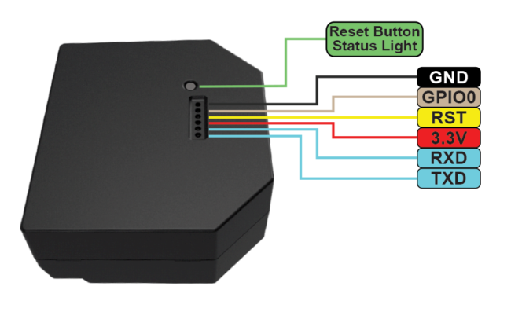
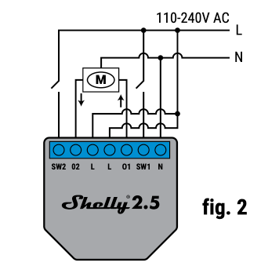
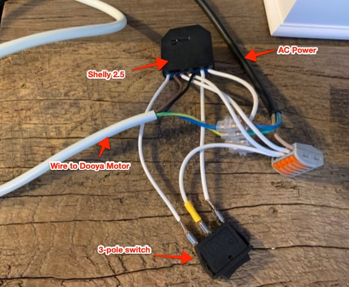
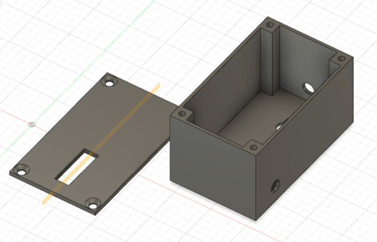
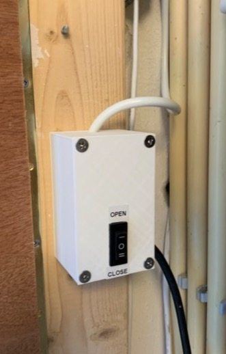
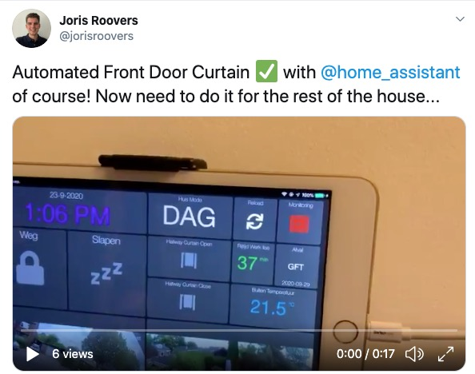

# Curtain Opener

This README contains some details (and files) on my solution for automated sliding curtains, integrated with home-assistant.

The project here is specifically about **side sliding curtains**, which is very different from automating window blinds for which there are plenty off-the-shelf and affordable solutions available. Most notably the [FYRTUR](https://www.ikea.com/us/en/cat/electric-blinds-44531/) blinds from Ikea.

For side sliding curtains however there seem to be way less off-the-shelf products available. Most that do exist come with a bunch of trade-offs (expensive, vendor lock-in, needs *another hub*, too much work). I do believe this will change over the next few years, but as of mid-2020, it seems like some amount trade-off is inevitable. I eventually ended up with *dumb* electric curtain rails from Dooya in combination with a wifi-enabled smart relay ([Shelly 2.5](https://shelly.cloud/products/shelly-25-smart-home-automation-relay/)) that I flashed using [ESPHome](https://esphome.io/).

# Other solutions

- [Somfy automated curtains](https://www.somfysystems.com/en-us/products/shades-blinds-curtains/motorized-curtains)
- [Slide kickstarter](https://www.kickstarter.com/projects/41829059/slide-make-your-existing-curtains-smart) 
- [Xiaomi Aqara Curtains](https://www.aqara.com/en/smart_curtain_motor.html)
- [Full custom designed solution (reddit)](https://www.reddit.com/r/functionalprint/comments/d282u9/i_wanted_my_regular_curtains_to_open_and_close/)
- [Another customized solution (thingiverse)](https://www.thingiverse.com/thing:2981670) 

# My solution

## Dooya Curtain Rails

I used the [Dooya 52S (45W)](https://aliexpress.com/item/33009907003.html) motor with the [compatible curtain rails](https://aliexpress.com/item/33045597780.html).

## Shelly 2.5

To make the curtains *smart*, I hooked up the Dooya motor to the [Shelly 2.5](https://shelly.cloud/products/shelly-25-smart-home-automation-relay/) which is essentially a double relay attached to the wifi-capable ESP8266 micro-controller. I then flashed the [ESPHome](https://esphome.io/) firmware on it, after which it becomes very easy to program it and integrate it with home-assistant.

### Flashing

This requires an UART/Serial controller like the [FTDI32](https://nl.aliexpress.com/item/32617951363.html).

If you have no idea what that last sentence meant, don't worry, it's not that hard and can be learned in a few hours. 

Some tutorials that look good:
- https://learn.sparkfun.com/tutorials/serial-communication/all
- https://learn.sparkfun.com/tutorials/sparkfun-usb-to-serial-uart-boards-hookup-guide/all

I [followed the instructions from Tasmota on flasing Shelly 2.5](https://tasmota.github.io/docs/devices/Shelly-2.5/)
to figure out the hardware/wiring part. It's a little tricky because you'll probably need to solder some wires onto
small pins.

Shelly 2.5 pinout or UART:



- Shelly-RXD -> FTDI-TX (IMPORTANT: Shelly2.5 RX is connected to TX on FTDI!)
- Shelly-TXD -> FTDI-RX (IMPORTANT: Shelly2.5 TX is connected to RX on FTDI!)
- Shelly-3.3V -> FTDI VCC (VERY IMPORTANT: make sure to set the voltage jumper correctly on the FTDI is set to 3.3v
  otherwise you risk frying the Shelly)
- Shelly-RST -> Leave Open (not connected to FTDI)
- Shelly-GPIO0 -> FTDI GND
- Shelly-GND -> FTDI GND

IMPORTANT: **BOTH** `GPIO0` and `GND` on the Shelly need to be connected to GND on FTDI to get the Shelly into flash mode, just doing one of them won't work.

### Wiring

I wired the Dooya curtain motor as documented on the [Shelly 2.5 User Manual](https://shelly.cloud/documents/user_guide/shelly_25.pdf), and added a 3-pole switch as well for manual opening and closing of the curtains.

Wiring schematic:




What it looks like in real-life:




### Installing the ESPHome firmware
I used the [curtain-opener.yaml](curtain-opener.yaml) ESPHome config file to program the Shelly to open and close the curtains.
It's basically just modified a example from https://esphome-configs.io/devices/shelly-25/

```sh
virtualenv .venv && source .venv/bin/activate
pip install esphome

esphome curtain-opener.yaml run

# Set curtain opener duration to 8s (default = 6s)
esphome -s duration 8s curtain-opener.yaml run
```

### Enclosure
The shelly together with all the wiring is mounted inside a simple custom designed and 3D printed enclosure. The CAD files can be found in the [enclosure](enclosure/) directory.



### End Result

3D-printed and mounted  enclosure with manual controls:



Link to [short video clip](https://twitter.com/jorisroovers/status/1309063181210390529), integrated with homeassistant:

[](https://twitter.com/jorisroovers/status/1309063181210390529)

